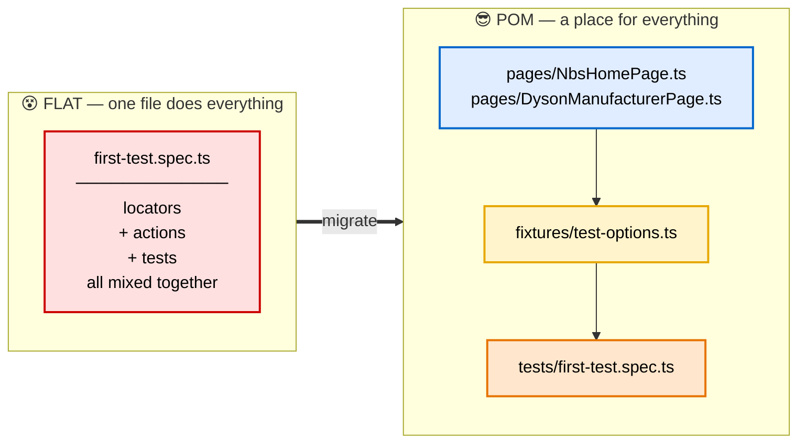
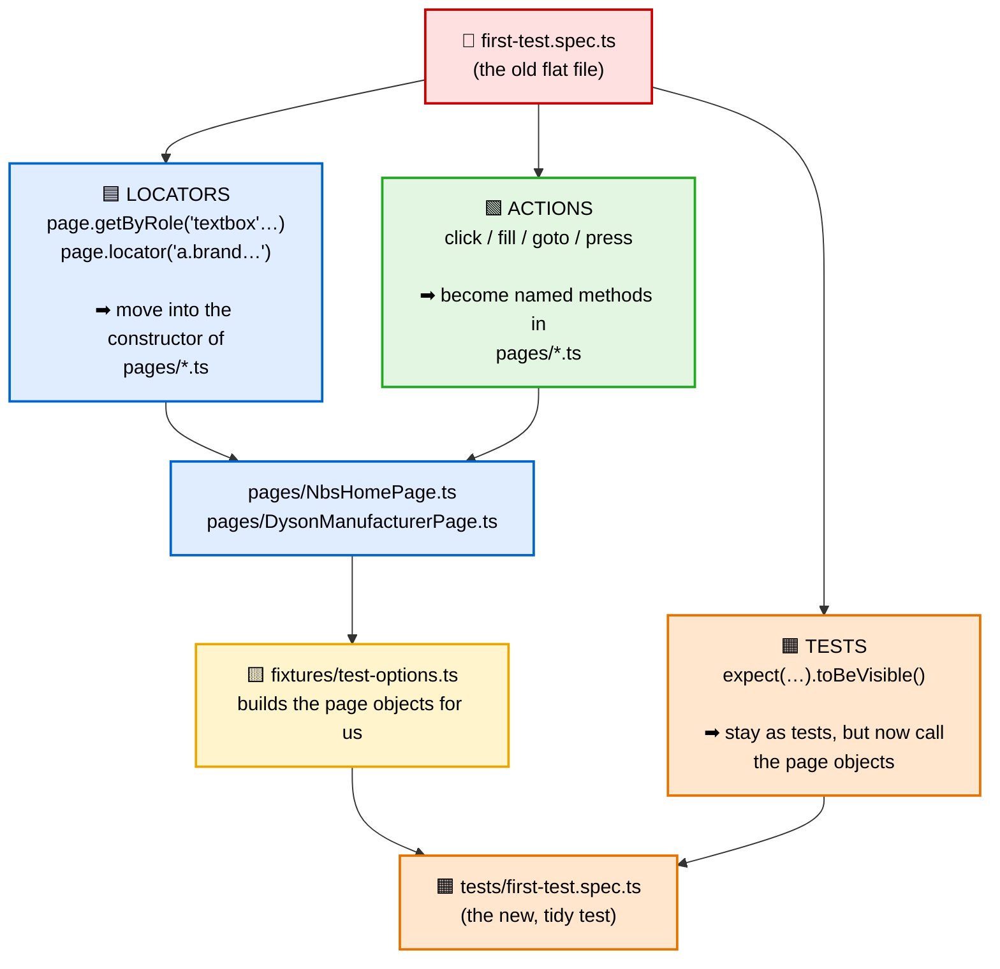
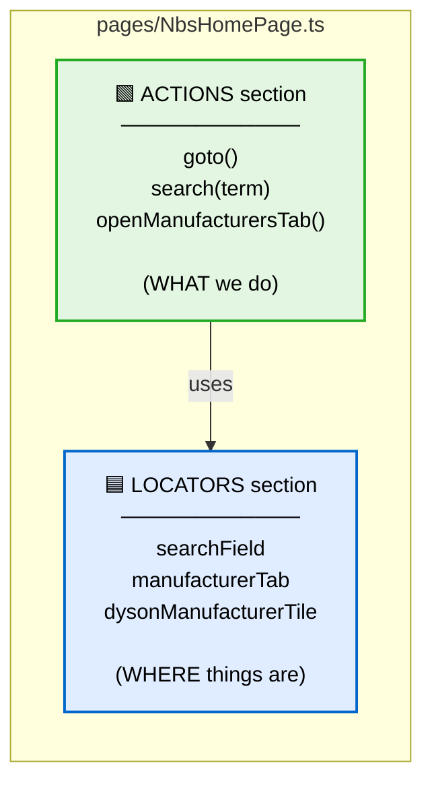
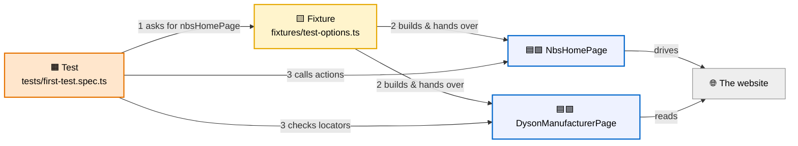
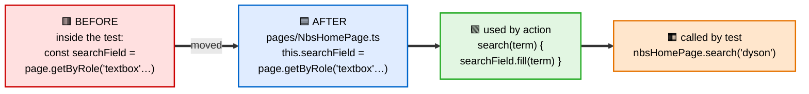

# Flat File vs Page Object Model — A Visual Guide

This is the **picture** version of the previous document. No walls of code — just diagrams that
show how our old single test file gets split up into the Page Object Model (POM), and where each
piece ends up.

> 📌 **How to read this:** the diagrams below are written in *Mermaid*. GitHub (and VS Code with a
> Mermaid extension) draws them automatically. The colours are the key — every box is coloured by
> **what kind of thing it is**:
>
> - 🟦 **Locators** — *WHERE* things are on the page
> - 🟩 **Actions** — *WHAT* we do on the page
> - 🟨 **Fixtures** — the "glue" that builds page objects for us
> - 🟧 **Tests** — the actual checks

---

## 1. The big picture — before and after

On the left, **everything lives in one file**. On the right, POM gives each kind of code its
**own home**.

---

## 2. Where does each line of the flat file go?

This is the heart of it. The single flat file gets **pulled apart**, and each type of code moves to
a specific new file.

**In one sentence:** locators and actions leave the test and move into `pages/`, a fixture builds
those page objects, and the test just *uses* them.

---

## 3. Locators vs Actions — the split inside one page object

Inside each `pages/*.ts` file there are **two clearly-labelled sections**. Same file, two jobs.

> 💡 The **actions use the locators** — e.g. `search()` uses `searchField`. That's why an action
> arrow points *into* the locators box. Change a locator once, and every action still works.

---

## 4. How it all connects when a test runs

This shows the "flow" at run-time — who builds what, and who talks to whom.

**The story in 3 steps:**
1. The test says *"I need `nbsHomePage`"* — it never writes `new NbsHomePage(page)` itself.
2. The **fixture** builds the page object(s) and hands them over.
3. The test **calls actions** and **checks locators** — reading almost like plain English.

---

## 5. The one-locator journey (a concrete example)

Follow a *single* locator — the search box — from the old file to the new one.

If the website changes that search box, you now fix it in **one place** (the blue box) instead of
in every test. That single benefit is the whole reason POM exists. 🎉

---

## 6. Cheat-sheet

| Old flat file had…            | In POM it becomes…                        | Which file             |
| ----------------------------- | ----------------------------------------- | ---------------------- |
| 🟦 `page.getByRole(...)`       | a locator property in the constructor     | `pages/*.ts` (LOCATORS)|
| 🟩 `click` / `fill` / `goto`   | a named `async` action method             | `pages/*.ts` (ACTIONS) |
| `new SomePage(page)`          | done for you automatically                | `fixtures/test-options.ts` |
| 🟧 `expect(...)` checks        | stays a test, but calls the page objects  | `tests/*.spec.ts`      |

> 👉 For the full step-by-step code walkthrough, see **`02-page-object-model.md`**. This document is
> the map; that one is the guided tour.
