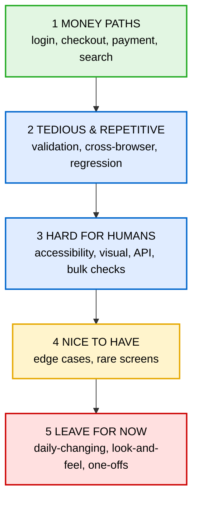

# What to Automate First 🎯

A quick guide to picking the right tests to automate first: the highest value to the business, and
the boring repetitive jobs humans shouldn't be doing by hand.

> **Golden rule:** automate what is **high value** *and* **run often**. Start there.

---

## The 4 questions

Score any test against these. More "yes" answers = higher priority.

| Question | Why |
| --- | --- |
| **Does the business lose money if it breaks?** | Login, checkout, payments come first. |
| **How often is it used?** | Something every customer hits daily beats a rare admin screen. |
| **Is it boring and repetitive by hand?** | Perfect for a robot. |
| **Is it stable?** | Stable pages are cheap to keep automated; daily-changing ones aren't yet. |

---

## 1. Money paths first 💰

The journeys the business can't afford to have broken (a.k.a. **smoke / critical-path tests**):

- **Login / sign-up** — if users can't get in, nothing else matters.
- **Search & find a product.**
- **Add to basket → checkout → payment** — the single most important journey.
- **Contact / enquiry forms** — how leads reach the business.

## 2. Tedious, repetitive checks 😴

- **Form validation** — many combinations of good/bad input.
- **Cross-browser** — same test on Chrome, Firefox, Safari (free via `projects` in `playwright.config.ts`).
- **Data-driven** — same test over a long list of inputs.
- **Regression** — re-running old tests after a change. This is where automation pays off most.

## 3. Hard or slow for a human 🧪

- **Accessibility** — already done here with `axe-core`.
- **Visual** — before/after screenshot comparison.
- **API** — testing services directly; fast and reliable.
- **Bulk checks** — dozens of links/images all load.

---

## Leave for later 🙅

- **Features changing daily** — wait until they settle.
- **Look-and-feel / "does it feel right?"** — better as exploratory testing by a person.
- **One-off checks** — doing it by hand once is cheaper.
- **Very flaky areas** — fix the flakiness first.

---

## Priority ladder 🪜

